# System Architecture

## Overview

This document presents the system architecture of the Urban Waste Management Platform using a C4 Component diagram style visualization in Mermaid.js.

## Architecture Diagram

```mermaid
graph TB
    subgraph "Frontend Layer - React Application"
        CP[Citizen Portal<br/>PublicView.tsx]
        SD[Supervisor Dashboard<br/>SupervisorDashboard.tsx]
        TA[Technician App<br/>TechnicianDashboard.tsx]
        AD[Admin Dashboard<br/>AdminDashboard.tsx]
        ED[Employee Dashboard<br/>EmployeeDashboard.tsx]
    end

    subgraph "API Layer - Spring Boot REST Controllers"
        RC[RouteController<br/>/api/routes]
        SC[SignalementController<br/>/api/signalements]
        VC[VehicleController<br/>/api/vehicles]
        CC[CollectionPointController<br/>/api/points]
        EC[EmployeeController<br/>/api/employees]
        AC[AdminController<br/>/api/admins]
        TC[TechnicienController<br/>/api/technicien]
        PC[PublicController<br/>/api/public]
    end

    subgraph "Business Logic Layer - Service Classes"
        RS[RouteService<br/>Smart Merge Logic]
        SS[SignalementService]
        VS[VehicleService]
        CS[CollectionPointService]
        ES[EmployeeService]
        AS[AdminService]
        TS[TechnicienService]
    end

    subgraph "Persistence Engine - XMLHandler (Gatekeeper)"
        XH[XMLHandler<br/>JAXB Marshaller/Unmarshaller<br/>Schema Validation]
    end

    subgraph "Validation Layer - XSD Schemas"
        XSD1[tournees.xsd]
        XSD2[signalements.xsd]
        XSD3[vehicules.xsd]
        XSD4[pointsCollecte.xsd]
        XSD5[employees.xsd]
        XSD6[techniciens.xsd]
        XSD7[admins.xsd]
        XSD8[superviseurs.xsd]
        XSD9[notifications.xsd]
    end

    subgraph "Storage Layer - Physical XML Files"
        XML1[tournees.xml]
        XML2[signalements.xml]
        XML3[vehicules.xml]
        XML4[pointsCollecte.xml]
        XML5[employees.xml]
        XML6[techiciens.xml]
        XML7[admins.xml]
        XML8[superviseurs.xml]
        XML9[notifications.xml]
    end

    %% Frontend to API connections
    CP -->|HTTP REST| PC
    CP -->|HTTP REST| SC
    SD -->|HTTP REST| RC
    SD -->|HTTP REST| SC
    TA -->|HTTP REST| TC
    TA -->|HTTP REST| VC
    AD -->|HTTP REST| RC
    AD -->|HTTP REST| VC
    AD -->|HTTP REST| CC
    AD -->|HTTP REST| EC
    AD -->|HTTP REST| AC
    ED -->|HTTP REST| RC

    %% API to Service connections
    RC --> RS
    SC --> SS
    VC --> VS
    CC --> CS
    EC --> ES
    AC --> AS
    TC --> TS
    PC --> RS

    %% Service to XMLHandler connections
    RS -->|saveToXML<br/>loadFromXML| XH
    SS -->|saveToXML<br/>loadFromXML| XH
    VS -->|saveToXML<br/>loadFromXML| XH
    CS -->|saveToXML<br/>loadFromXML| XH
    ES -->|saveToXML<br/>loadFromXML| XH
    AS -->|saveToXML<br/>loadFromXML| XH
    TS -->|saveToXML<br/>loadFromXML| XH

    %% XMLHandler to Validation connections
    XH -->|validateXML| XSD1
    XH -->|validateXML| XSD2
    XH -->|validateXML| XSD3
    XH -->|validateXML| XSD4
    XH -->|validateXML| XSD5
    XH -->|validateXML| XSD6
    XH -->|validateXML| XSD7
    XH -->|validateXML| XSD8
    XH -->|validateXML| XSD9

    %% XMLHandler to Storage connections
    XH -->|File I/O| XML1
    XH -->|File I/O| XML2
    XH -->|File I/O| XML3
    XH -->|File I/O| XML4
    XH -->|File I/O| XML5
    XH -->|File I/O| XML6
    XH -->|File I/O| XML7
    XH -->|File I/O| XML8
    XH -->|File I/O| XML9

    %% Styling
    classDef frontend fill:#e1f5ff,stroke:#01579b,stroke-width:2px
    classDef api fill:#fff3e0,stroke:#e65100,stroke-width:2px
    classDef service fill:#f3e5f5,stroke:#4a148c,stroke-width:2px
    classDef persistence fill:#e8f5e9,stroke:#1b5e20,stroke-width:2px
    classDef validation fill:#fff9c4,stroke:#f57f17,stroke-width:2px
    classDef storage fill:#fce4ec,stroke:#880e4f,stroke-width:2px

    class CP,SD,TA,AD,ED frontend
    class RC,SC,VC,CC,EC,AC,TC,PC api
    class RS,SS,VS,CS,ES,AS,TS service
    class XH persistence
    class XSD1,XSD2,XSD3,XSD4,XSD5,XSD6,XSD7,XSD8,XSD9 validation
    class XML1,XML2,XML3,XML4,XML5,XML6,XML7,XML8,XML9 storage
```

## Architecture Flow Description

### 1. Frontend Layer (React)
- **Citizen Portal** (`PublicView.tsx`): Public-facing interface for citizens to view schedules and submit reports
- **Supervisor Dashboard** (`SupervisorDashboard.tsx`): Management interface for supervisors to manage tours and reports
- **Technician App** (`TechnicianDashboard.tsx`): Mobile-friendly interface for technicians to update vehicle status
- **Admin Dashboard** (`AdminDashboard.tsx`): Administrative interface for system management
- **Employee Dashboard** (`EmployeeDashboard.tsx`): Employee interface for viewing assigned routes

### 2. API Layer (Spring Boot REST Controllers)
- **RouteController** (`/api/routes`): Handles route (Tournee) CRUD operations
- **SignalementController** (`/api/signalements`): Manages citizen and employee reports
- **VehicleController** (`/api/vehicles`): Vehicle management endpoints
- **CollectionPointController** (`/api/points`): Collection point operations
- **EmployeeController** (`/api/employees`): Employee management
- **AdminController** (`/api/admins`): Admin user management
- **TechnicienController** (`/api/technicien`): Technician-specific endpoints
- **PublicController** (`/api/public`): Public endpoints for schedules

### 3. Business Logic Layer (Service Classes)
- **RouteService**: Implements "Smart Merge" logic to preserve existing data during updates, preventing data loss
- **SignalementService**: Handles report creation and status updates
- **VehicleService**: Manages vehicle status and availability
- **CollectionPointService**: Collection point operations
- **EmployeeService**: Employee management logic
- **AdminService**: Admin operations with merge logic
- **TechnicienService**: Technician-specific business logic

### 4. Persistence Engine (XMLHandler - "The Gatekeeper")
- **XMLHandler**: Central component responsible for:
  - JAXB marshalling/unmarshalling (Java ↔ XML conversion)
  - Automatic XSD schema validation before save operations
  - File I/O operations with thread-safe synchronized methods
  - Schema caching for performance optimization
  - Context caching for JAXB operations

### 5. Validation Layer (XSD Schemas)
- **9 XSD Schema Files**: Define the structure and validation rules for all XML entities
- **Automatic Validation**: XMLHandler validates all data against XSD schemas before persistence
- **Type Safety**: Ensures data integrity and prevents invalid XML structures

### 6. Storage Layer (Physical XML Files)
- **XML Files**: Persistent storage in `backend/src/main/resources/data/`
- **File-based Database**: XML files serve as the database, providing:
  - Atomic operations via synchronized methods
  - Data consistency through Smart Merge logic
  - Immediate persistence on all CRUD operations

## Key Architectural Patterns

### 1. Layered Architecture
- Clear separation of concerns across Frontend → API → Service → Persistence → Storage
- Each layer has a well-defined responsibility

### 2. Gatekeeper Pattern
- **XMLHandler** acts as the single point of entry for all XML operations
- Enforces validation and consistency rules

### 3. Smart Merge Pattern
- **RouteService.updateRoute()** implements intelligent merging to preserve existing data
- Prevents accidental data loss during partial updates

### 4. Schema-First Validation
- All data is validated against XSD schemas before persistence
- Ensures data integrity at the persistence layer

### 5. RESTful API Design
- Standard HTTP methods (GET, POST, PUT, DELETE)
- JSON responses for frontend consumption
- XML persistence transparent to API consumers

## Data Flow Example: Creating a Route

1. **Frontend**: User submits route form in `SupervisorDashboard.tsx`
2. **API**: `POST /api/routes` → `RouteController.createRoute()`
3. **Service**: `RouteService.createRoute()` validates business rules
4. **Persistence**: `XMLHandler.saveToXML()` is called
5. **Validation**: XMLHandler validates against `tournees.xsd`
6. **Storage**: Validated data is written to `tournees.xml`
7. **Response**: Route object is returned as JSON to frontend

## Security & Validation

- **XSD Validation**: All XML data is validated against schemas before save
- **Synchronized Operations**: Thread-safe file operations prevent race conditions
- **Atomic ID Generation**: `AtomicInteger` ensures unique ID generation
- **Business Rule Validation**: Service layer enforces domain-specific rules

## Performance Optimizations

- **JAXB Context Caching**: XMLHandler caches JAXB contexts to avoid recreation
- **Schema Caching**: XSD schemas are loaded once and cached
- **ConcurrentHashMap**: Thread-safe caching for contexts and schemas

